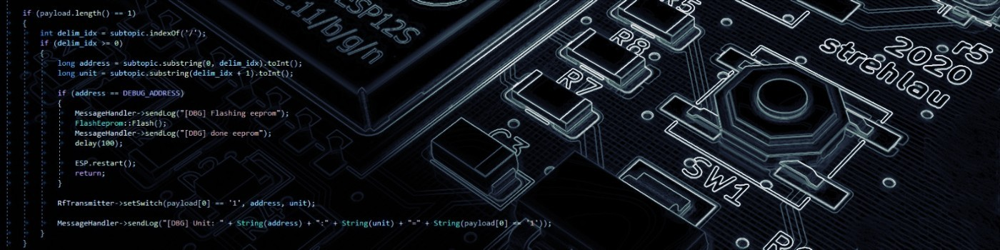
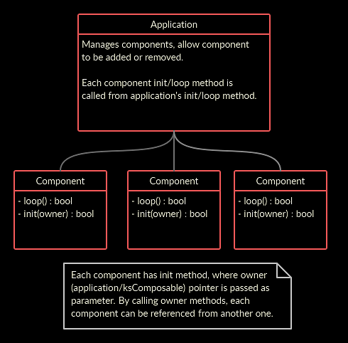

# ksIotFrameworkLib
<p align="center">
  
</p>

The aim of this project is to provide simple kick-start application pattern for ESP 8266/32 IoT app development. Last year I was creating a lot of esp apps for multiple devices and realized that I everytime need to copy whole app and modify few classes. The purpose of this project is to tidy this process up.

## Architecture
<p align="center">
  
</p>

## Utilities
| Utility  | Function |
| ------------- | ------------- |
| ksEvent  | Provides simple vent broadcasting system. Used for MQTT events etc. |
| ksSafeList  | Safe list in context of manipulating items while iterating them. Contains three underlying queues - pending to add, pending to remove and actual item list. Call **queueAdd** or **queueRemove** while iterating and then call **synchronizeQueues**. Component system relies on this mechanism. |

## Components
| Component  | Function |
| ------------- | ------------- |
| ksConfigProvider  | Used to manage parameters, configurator component calls each config provider to handle parameter inject/capture on WiFi configuration stage. |
| ksLed  | Used to handle diodes, easy blinking, turn off, turn on etc. |
| ksResetButton  | Used to break from app loop or reset whole device (to trigger config portal). |
| ksMqttConfigProvider  | Used to manage MQTT parameters (broker, password, prefix etc..). |
| ksMqttConnector  | Used to maintain connection with Mqtt, user can bind to onMessage, onConnected events. |
| ksMqttDebugResponder  | Provides debug commands for app with ksMqttConnector component. |
| ksTimer  | Easy timer component with multiple events support. |
| ksWiFiConfigurator | Base WiFi configurator component, brings WiFi management portal, allow config providers to inject and capture parameters. |
| ksWiFiConnector | Handles WiFi connection. |

### Rules:
- Components can be added only in app init method, before calling base init method.
- Method **findComponent** must not be called from component init methods.
- Method **postInit** is the best place to obtain other component weak pointer, by calling **findComponent**.
- Currently dynamic (from outside of **init** method) coponent creation is not supported.

## Building application
To build an application simply create new class inherited from ksApplication. Inside init method add components and setup them, then call base ksApplication's init method. You can also optionally override loop method, but remember that baseclass method (ksApplication's loop) iterates over component list executing loop call on each registered component.

## A word of warning
The idea was to prevent launching application when any component initialization fail. This will lead to false returned from ksApplication::init (base class) method, but due to inheritance, user can override it's behaviour. Application will then try to launch and after initialization, it will tick every component, even if one of them failed to initialize. This can lead to crashes, especially inside loop method.

**Do not add components inside loop() method. If you want to destroy component from loop just queue component to destroy (queueDestroy) method. To add component from loop method, then some kind of queue should be implemented.**

### So the flow is...
- Add components (addComponent simply construct class and add it's pointer to app component list).
- Run ksApplicaiton:init (it will iterate through component list and initialize them, returning false if any init failed).
- If ksApplication::init() does not return true, simply return false in your app init method

```c++
bool EnergyMonitor::init()
{
	addComponent<ksf::ksWifiConnector>(EnergyMonitorConfig::emonDeviceName);
	addComponent<ksf::ksMqttDebugResponder>();
	mqtt = addComponent<ksf::ksMqttConnector>();
	statusLed = addComponent<ksf::ksLed>(STATUS_LED_PIN);
	eventLed = addComponent<ksf::ksLed>(EVENT_LED_PIN);

	auto sensor_timer = addComponent<ksf::ksTimer>(EMON_TIMER_INTERVAL, true);
	auto sec_timer = addComponent<ksf::ksTimer>(EMON_SEC_TIMER, true);
	
	if (!ksApplication::init())
		return false;

	/* [ Rest of application initialization code ] */
}
```

## RTTI - compiler flags
Component subsystem requires RTTI C++ feature. To enable, simply pass `-frtti` in `compiler.cpp.extra_flags=` option in your board.txt file.
Whole example setup:
```ini
# ksIotFramework build property overrides
compiler.cpp.extra_flags=-fno-split-wide-types -finline-limit=3 -ffast-math -frtti
```
## Saving power
By default, this framework supports modem power saving. This requires DTIM set on access point. Best value for me is 3.
It allows ESP32 to go down from around 100mA to 20mA.

## Dependencies

**Unfortunately, right now, there is a lot of manual work to do to setup dependencies. WiFiManager, ksIotFrameworkLib must be installed as ZIP. It's recommended to setup Git to track ksIotFrameworkLib directory to follow latest changes on this repository. PubSubClient and ArduinoOTA can be downloaded within library manager.**

This project depends on following libraries:
### Arduino for ESP8266/32
Arduino development environment for Espressif MCUs.
- https://github.com/espressif/arduino-esp32
- https://github.com/esp8266/Arduino
### WiFiManager
Works like access point, so user can connect and setup device on first run.
- https://github.com/cziter15/WiFiManager (original at https://github.com/tzapu/WiFiManager)
### PubSubClient
Handles MQTT (MQ Telemetry Transport) protocol.
- https://github.com/knolleary/pubsubclient

## PubSubClient related quirks
Up to 1.0.6 arduino-ESP32 connect method variant without timeout specified defaulted to no timeout. PubSubClient uses one of these variants and it may lead to device hang or reset (caused by watchdog).

Later versions should have my contributed fix, eliminating the problem from arduino-esp32 side:
- https://github.com/espressif/arduino-esp32/pull/5487

Fix can be also done in PubSubClient, but please read discussion first.
- https://github.com/knolleary/pubsubclient/pull/842

## WiFiManager related quirks
Above 1.0.6 version of Arduino ESP32, they have changed WiFi callbacks, causing WiFiManager compilation fail.

I've fixed that, so you can grab modiffied WiFiManager from here: 

https://github.com/cziter15/WiFiManager
