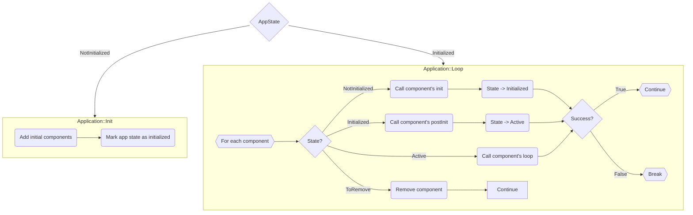

# ksIotFrameworkLib

> Arduino Library for ESP32/ESP8266 - a composition-oriented Internet of Things framework that provides a simple and extendable architecture, handles device setup (WiFi setup, MQTT and application-specific configuration), network connectivity, MQTT telemetry protocol, and more...

[](https://cziter15.github.io/ksIotFrameworkLib)
[](https://github.com/cziter15/ksIotFrameworkLib/blob/master/LICENSE)

[](https://app.codacy.com/gh/cziter15/ksIotFrameworkLib/dashboard?utm_source=gh&utm_medium=referral&utm_content=&utm_campaign=Badge_grade) 
[](https://github.com/cziter15/ksiotframeworklib)
[](https://github.com/cziter15/ksIotFrameworkLib/commits/master)
[](https://platformio.org)
[](https://github.com/pioarduino)


> **IMPORTANT FOR ESP32**
>
> This library targets Arduino 3+ on ESP32. Due to [PlatformIO limitations](https://github.com/platformio/platform-espressif32/issues/1225), it does not automatically fetch the latest versions.
> Use the pioarduino fork by Jason2866 in your `platformio.ini` file:
> ```ini
> platform = https://github.com/pioarduino/platform-espressif32.git
> ```

> **IMPORTANT FOR ESP8266**
>
> For ESP8266, the latest supported version is based on SDK305.
> To use it, please add this build flag:
> ```plaintext
> DPIO_FRAMEWORK_ARDUINO_ESPRESSIF_SDK305
>```

## 📜 Motivation

- The goal of this project is to create a simple template or starting point for developing IMotivationoT applications using Espressif microcontrollers.
- This project aims to streamline the process of copying and modifying source code for different devices.

## 📚 Documentation

- Detailed documentation can be found [here](https://cziter15.github.io/ksIotFrameworkLib).

## Examples

- For examples, refer to the [examples directory](https://github.com/cziter15/ksIotFrameworkLib/tree/master/examples).

## 🛠️ Architecture



- Only one application runs at a time.
- Each application manages its own set of components, the framework's core building blocks.
- Component states are managed within the application's `loop` function.
- Components implement `init`, `postInit`, and `loop` methods.
- Components marked for removal are safely deleted in the next cycle.

## 📏 Utilities


## 🔨 Components


### 🔅 Rules:
- Components should be added in the app's `init` method, so they will be available for `postInit` methods. (you can add them later, in `loop` but that's another case)
- The `init` method is the best place to add dependent components, setup initial pin values etc.
- The `postInit` method is the best place to obtain a weak pointer to another component by calling `findComponent`. This will handle cases when other components were added via `init` method.

## 🌱 Building the Application

To create an application, define a new class that inherits from `ksApplication` and add initial components in the `init` method. Refer to projects like [**emon_fw**](https://github.com/cziter15/emon_fw) for a practical example.

### 🔎 How It Works
- The application is instantiated, and its init method is called. If `init` returns `false`, the `loop` method is skipped, and the App Rotator proceeds to instantiate and run the next application in its sequence.
- If `init` returns `true`, the `loop` method executes, initializing all components.
- In the next iteration, each component’s `postInit` method is invoked.
- Once initialized, the application enters a continuous loop, calling each component’s `loop` method.
- If any component’s `loop` method returns `false`, the application terminates, and the App Rotator proceeds to the next application.

```cpp
bool PelletInfo::init()
{
    // Add WiFi and MQTT debug components
    addComponent<ksf::comps::ksWifiConnector>(PelletInfoConfig::pelletInfoDeviceName);
    addComponent<ksf::comps::ksMqttDebugResponder>();
    addComponent<ksf::comps::ksDevStatMqttReporter>();

    // Add OTA updater component
    addComponent<ksf::comps::ksDevicePortal>();

    // Add state display and receiver components
    addComponent<comps::StateDisplay>();
    addComponent<comps::StateReceiver>();

    // Add reset button component
    addComponent<ksf::comps::ksResetButton>(CFG_PUSH_PIN, LOW);

    // Add MQTT connector component
    addComponent<ksf::comps::ksMqttConnector>();

    // Initialization completed; return true to indicate success
    return true;
}
```

## 🔁 Application rotator
The library implements one very useful utility named `ksAppRotator`. This object can wrap application instantiation logic into something like carousel or rotator.

Typically the device hosts two applications. First application is running core device logic while the second one is dedicated to help the user with the device configuration. 

Each application has it's own `loop` method taking care of all underlying logic. In case of fail (which can happen anytime, even when creating the application object), the rotator will spawn next application and start processing it's logic until fail or break.

This is very flexible, because you can even raise fail (false) from application's `init` method and then go directly into the configuration mode (for example there's no WiFi credentials provided by the user).

## 🔣 Compiler flags
- Bare Arduino projects need to have `gnu++2a` enabled via `compiler.cpp.extra_flags=` option in the `board.txt` file.

## #️⃣ Custom RTTI
- Use the `KSF_RTTI_DECLARATIONS` macro to provide proper runtime type information generation for proper casting of components. 
- See `ksConfigProvider.h` for an example. Your application components should use this macro, otherwise the component finding mechanism won't work.

## 🔥 Saving power
- By default, this framework supports enables power saving for the modem.
- Automatic modem sleep requires the DTIM to be set on the access point. 
- The best value for me was 3. It allows the ESP32 to go down from around 100mA to 20mA.

## 📑 Dependencies
- **It is highly recommended to use PlatformIO as it will automatically download dependencies!**

### 🔡 Frameworks
- [Arduino for ESP32](https://github.com/espressif/arduino-esp32)
- [Arduino for ESP8266](https://github.com/esp8266/Arduino)

### 🔡 Libraries
- [PubSubClient](https://github.com/knolleary/pubsubclient)
- [arduinoWebSockets](https://github.com/Links2004/arduinoWebSockets)
