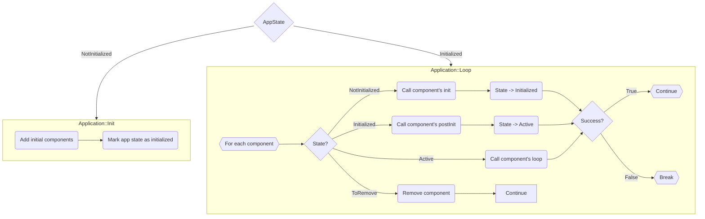

# ksIotFrameworkLib

> Arduino Library for ESP32/ESP8266 - composition oriented internet of things framework that provides simple and extendable architecture, handles device setup (WiFi setup, MQTT and application specific configuration), network connectivity, MQTT telemetry protocol and more...

[](https://cziter15.github.io/ksIotFrameworkLib)
[](https://github.com/cziter15/ksIotFrameworkLib/blob/master/LICENSE)

[![Build for PlatformIO](https://img.shields.io/badge/works%20best%20with-PlatformIO-orange?logo=data%3Aimage%2Fsvg%2Bxml%3Bbase64%2CPHN2ZyB3aWR0aD0iMjUwMCIgaGVpZ2h0PSIyNTAwIiB2aWV3Qm94PSIwIDAgMjU2IDI1NiIgeG1sbnM9Imh0dHA6Ly93d3cudzMub3JnLzIwMDAvc3ZnIiBwcmVzZXJ2ZUFzcGVjdFJhdGlvPSJ4TWlkWU1pZCI+PHBhdGggZD0iTTEyOCAwQzkzLjgxIDAgNjEuNjY2IDEzLjMxNCAzNy40OSAzNy40OSAxMy4zMTQgNjEuNjY2IDAgOTMuODEgMCAxMjhjMCAzNC4xOSAxMy4zMTQgNjYuMzM0IDM3LjQ5IDkwLjUxQzYxLjY2NiAyNDIuNjg2IDkzLjgxIDI1NiAxMjggMjU2YzM0LjE5IDAgNjYuMzM0LTEzLjMxNCA5MC41MS0zNy40OUMyNDIuNjg2IDE5NC4zMzQgMjU2IDE2Mi4xOSAyNTYgMTI4YzAtMzQuMTktMTMuMzE0LTY2LjMzNC0zNy40OS05MC41MUMxOTQuMzM0IDEzLjMxNCAxNjIuMTkgMCAxMjggMCIgZmlsbD0iI0ZGN0YwMCIvPjxwYXRoIGQ9Ik0yNDkuMzg2IDEyOGMwIDY3LjA0LTU0LjM0NyAxMjEuMzg2LTEyMS4zODYgMTIxLjM4NkM2MC45NiAyNDkuMzg2IDYuNjEzIDE5NS4wNCA2LjYxMyAxMjggNi42MTMgNjAuOTYgNjAuOTYgNi42MTQgMTI4IDYuNjE0YzY3LjA0IDAgMTIxLjM4NiA1NC4zNDYgMTIxLjM4NiAxMjEuMzg2IiBmaWxsPSIjRkZGIi8+PHBhdGggZD0iTTE2MC44NjkgNzQuMDYybDUuMTQ1LTE4LjUzN2M1LjI2NC0uNDcgOS4zOTItNC44ODYgOS4zOTItMTAuMjczIDAtNS43LTQuNjItMTAuMzItMTAuMzItMTAuMzJzLTEwLjMyIDQuNjItMTAuMzIgMTAuMzJjMCAzLjc1NSAyLjAxMyA3LjAzIDUuMDEgOC44MzdsLTUuMDUgMTguMTk1Yy0xNC40MzctMy42Ny0yNi42MjUtMy4zOS0yNi42MjUtMy4zOWwtMi4yNTggMS4wMXYxNDAuODcybDIuMjU4Ljc1M2MxMy42MTQgMCA3My4xNzctNDEuMTMzIDczLjMyMy04NS4yNyAwLTMxLjYyNC0yMS4wMjMtNDUuODI1LTQwLjU1NS01Mi4xOTd6TTE0Ni41MyAxNjQuOGMtMTEuNjE3LTE4LjU1Ny02LjcwNi02MS43NTEgMjMuNjQzLTY3LjkyNSA4LjMyLTEuMzMzIDE4LjUwOSA0LjEzNCAyMS41MSAxNi4yNzkgNy41ODIgMjUuNzY2LTM3LjAxNSA2MS44NDUtNDUuMTUzIDUxLjY0NnptMTguMjE2LTM5Ljc1MmE5LjM5OSA5LjM5OSAwIDAgMC05LjM5OSA5LjM5OSA5LjM5OSA5LjM5OSAwIDAgMCA5LjQgOS4zOTkgOS4zOTkgOS4zOTkgMCAwIDAgOS4zOTgtOS40IDkuMzk5IDkuMzk5IDAgMCAwLTkuMzk5LTkuMzk4em0yLjgxIDguNjcyYTIuMzc0IDIuMzc0IDAgMSAxIDAtNC43NDkgMi4zNzQgMi4zNzQgMCAwIDEgMCA0Ljc0OXoiIGZpbGw9IiNFNTcyMDAiLz48cGF0aCBkPSJNMTAxLjM3MSA3Mi43MDlsLTUuMDIzLTE4LjkwMWMyLjg3NC0xLjgzMiA0Ljc4Ni01LjA0IDQuNzg2LTguNzAxIDAtNS43LTQuNjItMTAuMzItMTAuMzItMTAuMzItNS42OTkgMC0xMC4zMTkgNC42Mi0xMC4zMTkgMTAuMzIgMCA1LjY4MiA0LjU5MiAxMC4yODkgMTAuMjY3IDEwLjMxN0w5NS44IDc0LjM3OGMtMTkuNjA5IDYuNTEtNDAuODg1IDIwLjc0Mi00MC44ODUgNTEuODguNDM2IDQ1LjAxIDU5LjU3MiA4NS4yNjcgNzMuMTg2IDg1LjI2N1Y2OC44OTJzLTEyLjI1Mi0uMDYyLTI2LjcyOSAzLjgxN3ptMTAuMzk1IDkyLjA5Yy04LjEzOCAxMC4yLTUyLjczNS0yNS44OC00NS4xNTQtNTEuNjQ1IDMuMDAyLTEyLjE0NSAxMy4xOS0xNy42MTIgMjEuNTExLTE2LjI4IDMwLjM1IDYuMTc1IDM1LjI2IDQ5LjM2OSAyMy42NDMgNjcuOTI2em0tMTguODItMzkuNDZhOS4zOTkgOS4zOTkgMCAwIDAtOS4zOTkgOS4zOTggOS4zOTkgOS4zOTkgMCAwIDAgOS40IDkuNCA5LjM5OSA5LjM5OSAwIDAgMCA5LjM5OC05LjQgOS4zOTkgOS4zOTkgMCAwIDAtOS4zOTktOS4zOTl6bS0yLjgxIDguNjcxYTIuMzc0IDIuMzc0IDAgMSAxIDAtNC43NDggMi4zNzQgMi4zNzQgMCAwIDEgMCA0Ljc0OHoiIGZpbGw9IiNGRjdGMDAiLz48L3N2Zz4=)](https://platformio.org)
[](https://hitsofcode.com/github/cziter15/ksIotFrameworkLib/view)
[](https://github.com/cziter15/ksIotFrameworkLib/commits/master)


> [!IMPORTANT]  
> This library targets Arduino 3+ on ESP32. However, due to [Platformio statement](https://github.com/platformio/platform-espressif32/issues/1225) it will not automatically pull latest versions.
> If you want latest version support, set your platform to pioarduino (by Jason2866) fork in your `platformio.ini` file.
> 
> ```platform = https://github.com/pioarduino/platform-espressif32.git```

> [!IMPORTANT]  
> When it comes to ESP8266, latest version supported is based on SDK305. To use it, add `-DPIO_FRAMEWORK_ARDUINO_ESPRESSIF_SDK305` to your build flags.


## 🌱 Motivation

- The goal of this project is to create a simple template or starting point to develop IoT applications using Espressif microcontrollers. 
- I was frequently copying and modifying source code for different devices and this is an attempt to streamline this process. 

## 📚 Doxygen
- Detailed documentation can be found on [here](https://cziter15.github.io/ksIotFrameworkLib).

## 🔎 Examples
- Soome people prefer to learn by example. In this, open the [examples directory](examples).


## ℹ️ Architecture


- Only one application can be executed simultaneously.
- Each application has its own components. Components are a key part of the framework.
- Components have states. State change logic is handled in the application's loop.
- Each component has init, postInit, and loop methods.
- Components can be marked for removal, and they will be safely released in the next tick.

## 📏 Utilities


## 🔨 Components


### 🔅 Rules:
- Components should be added in the app's **init** method, so they will be available for **postInit** methods. (you can add them later, in loop() but that's another case)
- The **init** method is the best place to add dependent components, setup initial pin values etc.
- The **postInit** method is the best place to obtain a weak pointer to another component by calling **findComponent**. This will handle cases when other components were added via init method.

## 🌱 Building the application
To build an application, simply create a new class inherited from ksApplication and add your initial components inside the init method. See projects like **emon_fw** for reference.

### 🔎 How does it work under the hood?
- The application is created, followed by the invocation of its init() method. If false is returned from the init method, the subsequent execution of the loop will be skipped, resulting in no iteration over the components. The App Rotator will then try to run next apllication.
- In case the init() method returns true, the application proceeds to execute its loop() function. This function traverses through the components, initializing each of them.
- In the subsequent iteration, the application triggers the postInitialize() method for each component.
- Following this, the application is fully initialized and enters a looping state where it iterates over the components, invoking their respective loop methods.
- If any component returns false during it's loop method, the application will break and the App Rotator will select the next application for execution.

```c++
bool PelletInfo::init()
{
	/* Create required components (Wifi and Mqtt debug). */
	addComponent<ksf::comps::ksWifiConnector>(PelletInfoConfig::pelletInfoDeviceName);
	addComponent<ksf::comps::ksMqttDebugResponder>();
	addComponent<ksf::comps::ksDevStatMqttReporter>();

	/* Create OTA updater component. */
	addComponent<ksf::comps::ksDevicePortal>();

	/* Create state display and receiver components. */
	addComponent<comps::StateDisplay>();
	addComponent<comps::StateReceiver>();

	/* Create reset button component. */
	addComponent<ksf::comps::ksResetButton>(CFG_PUSH_PIN, LOW);

	/* Create mqttConnector and statusLed components. */
	addComponent<ksf::comps::ksMqttConnector>();

	/* Application finished initialization, return true as it succedeed. */
	return true;
}
```

## 🔁 Application rotator
The library implements one very useful utility named ksAppRotator. This object can wrap application instantiation logic into something like carousel or rotator.

Typically the device hosts two applications. First application is running core device logic while the second one is dedicated to help the user with the device configuration. 

Each application has it's own loop method taking care of all underlying logic. In case of fail (which can happen anytime, even when creating the application object), the rotator will spawn next application and start processing it's logic until fail or break.

This is very flexible, because you can even raise fail (false) from application's init method and then go directly into the configuration mode (for example there's no WiFi credentials provided by the user).

## 🔣 Compiler flags
- Bare Arduino projects need to have `gnu++2a` enabled via `compiler.cpp.extra_flags=` option in the `board.txt` file.

## #️⃣ Custom RTTI
- Use the KSF_RTTI_DECLARATIONS macro to provide proper runtime type information generation for proper casting of components. 
- See ksConfigProvider.h for an example. Your application components should use this macro, otherwise the component finding mechanism won't work.

## 🔥 Saving power
- By default, this framework supports enables power saving for the modem.
- Automatic modem sleep requires the DTIM to be set on the access point. 
- The best value for was 3. It allows the ESP32 to go down from around 100mA to 20mA.

## 📑 Dependencies
- **It is highly recommended to use PlatformIO as it will automatically download dependencies!**

### 🔡 Frameworks
- Arduino for ESP32 [ https://github.com/espressif/arduino-esp32 ]
- Arduino for ESP8266 [ https://github.com/esp8266/Arduino ]

### 🔡 Libraries
- PubSubClient [ https://github.com/knolleary/pubsubclient ]
- arduinoWebSockets [ https://github.com/Links2004/arduinoWebSockets ]
