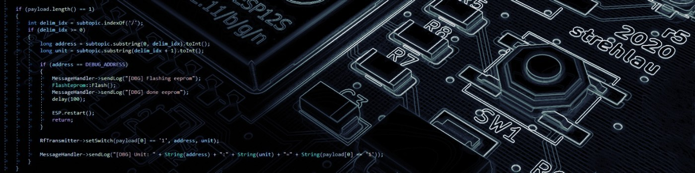
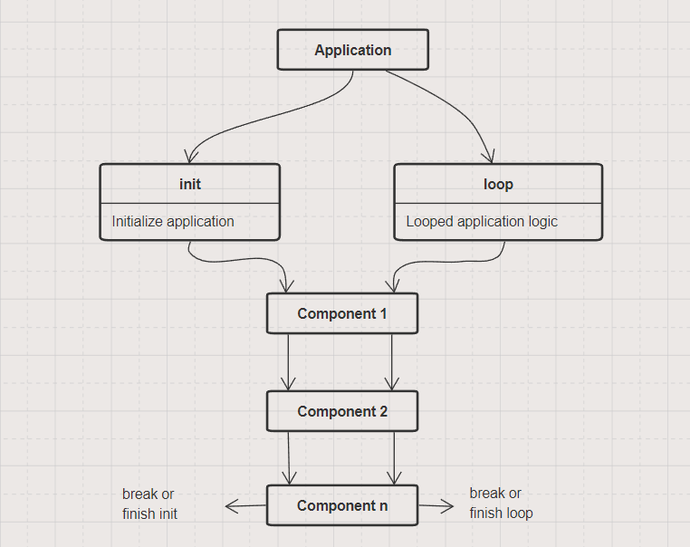

## StopTheWar
I've recently switched to PlatformIO as base endpoint for this library and I'm super-happy with this. Amazing support, amazing epxierence! I really loved PlatformIO. PlatformIO is a Ukrainian project, so I've decided to link their message here...

https://community.platformio.org/t/platformio-is-a-ukrainian-project-please-help-us-stop-the-war/26330

# ksIotFrameworkLib
<p align="center">
  
</p>

## Idea - what and why?

The aim of this project is to provide simple kick-start application pattern for ESP 8266/32 IoT app development. Last year I was creating a lot of esp apps for multiple devices and realized that I everytime need to copy whole app and modify few classes. The purpose of this project is to tidy this process up.

## Architecture
<p align="center">
  
</p>

- User defines applications and is able to execute one application at a time.
- Each application consist of components.
- Each application has three methods iterating over components init, postInit and loop.
- Init is called on component initialization (after construction).
- PostInit is called after component initialization. This method is usually used to grab weak pointer to other component.
- Loop is called every application loop.
- Init and loop method can break appliation. Returning false will escape from main application loop causing next app to be executed (e.g. config).

## Utilities
| Utility  | Function |
| ------------- | ------------- |
| ksEvent  | Provides simple event broadcasting system. Used for MQTT events etc. |
| ksSimpleTimer  | Very simple "timer" mechanism. In triggered() method calculates and check if specified interval just passed. |
| ksSafeList  | Safe list in context of manipulating items while iterating them. Contains three underlying queues - pending to add, pending to remove and actual item list. Call **queueAdd** or **queueRemove** while iterating and then call **synchronizeQueues**. Component system relies on this mechanism. |

## Components
| Component  | Function |
| ------------- | ------------- |
| ksConfigProvider  | Used to manage parameters, configurator component calls each config provider to handle parameter inject/capture on WiFi configuration stage. |
| ksLed  | Used to handle diodes, easy blinking, turn off, turn on etc. |
| ksResetButton  | Used to break from app loop or reset whole device (to trigger config portal). |
| ksMqttConfigProvider  | Used to manage MQTT parameters (broker, password, prefix etc..). |
| ksMqttConnector  | Used to maintain connection with Mqtt, user can bind to onMessage, onConnected events. |
| ksMqttDebugResponder  | Provides debug commands for app with ksMqttConnector component. |
| ksWiFiConfigurator | Base WiFi configurator component, brings WiFi management portal, allow config providers to inject and capture parameters. |
| ksWiFiConnector | Handles WiFi connection. |

### Rules:
- Components can be added only in app init method, before calling base init method.
- Method **findComponent** must not be called from component init methods.
- Method **postInit** is the best place to obtain other component weak pointer, by calling **findComponent**.
- Currently dynamic (from outside of **init** method) coponent creation is not supported.

## Building application
To build an application simply create new class inherited from ksApplication. Inside init method add components and setup them, then call base ksApplication's init method. You can also optionally override loop method, but remember that baseclass method (ksApplication's loop) iterates over component list executing loop call on each registered component.

## A word of warning
The idea was to prevent launching application when any component initialization fail. This will lead to false returned from ksApplication::init (base class) method, but due to inheritance, user can override it's behaviour. Application will then try to launch and after initialization, it will tick every component, even if one of them failed to initialize. This can lead to crashes, especially inside loop method.

**Do not add components inside loop() method. If you want to destroy component from loop just queue component to destroy (queueDestroy) method. To add component from loop method, then some kind of queue should be implemented.**

### So the flow is...
- Add components (addComponent simply construct class and add it's pointer to app component list).
- Run ksApplicaiton:init (it will iterate through component list and initialize them, returning false if any init failed).
- If ksApplication::init() does not return true, simply return false in your app init method

```c++
bool EnergyMonitor::init()
{
	addComponent<ksf::comps::ksWifiConnector>(EnergyMonitorConfig::emonDeviceName);
	addComponent<ksf::comps::ksMqttDebugResponder>();
	mqtt = addComponent<ksf::comps::ksMqttConnector>();
	statusLed = addComponent<ksf::comps::ksLed>(STATUS_LED_PIN);
	eventLed = addComponent<ksf::comps::ksLed>(EVENT_LED_PIN);

	auto sensor_timer = addComponent<ksf::comps::ksTimer>(EMON_TIMER_INTERVAL, true);
	auto sec_timer = addComponent<ksf::comps::ksTimer>(EMON_SEC_TIMER, true);
	
	if (!ksApplication::init())
		return false;

	/* [ Rest of application initialization code ] */
}
```

## RTTI - compiler flags
RTTI is required to properly cast component types and so on. By default RTTI for ESP32/ESP8266 is disabled in Arduino framework.

**If using platformio, simply add `build_unflags = -fno-rtti` line to your env configuration in platformio.ini file.**
**Recently added functionality handles this automatically, it works now on platformio dev, but will be available with pio 6.0.3 release.**

Bare arduino projects need to have `-frtti` in `compiler.cpp.extra_flags=` option in your board.txt file.

## Saving power
By default, this framework supports modem power saving. This requires DTIM set on access point. Best value for me is 3.
It allows ESP32 to go down from around 100mA to 20mA.

## Dependencies
**Highly recommended to use platformio as it will automatically download dependencies.**

### Frameworks
- Arduino for ESP32 [ https://github.com/espressif/arduino-esp32 ]
- Arduino for ESP8266 [ https://github.com/esp8266/Arduino ]

### Libraries
- WiFiManager [ https://github.com/tzapu/WiFiManager ]
- PubSubClient [ https://github.com/knolleary/pubsubclient ]

## Donate
Feel free to support development (of course optionally) :)

[](https://www.paypal.com/donate/?hosted_button_id=A3QTXX6MN9LN8)
