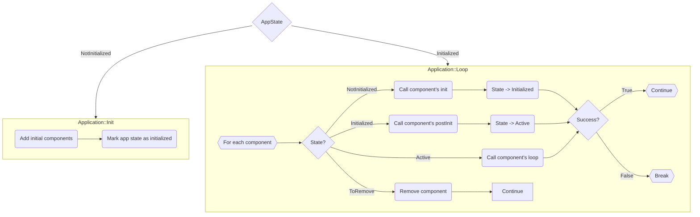

# ksIotFrameworkLib

> Arduino Library for ESP32/ESP8266 - a composition-oriented Internet of Things framework that provides a simple and extendable architecture, handles device setup (WiFi setup, MQTT and application-specific configuration), network connectivity, MQTT telemetry protocol, and more...

[](https://cziter15.github.io/ksIotFrameworkLib)
[](https://github.com/cziter15/ksIotFrameworkLib/blob/master/LICENSE)

[](https://app.codacy.com/gh/cziter15/ksIotFrameworkLib/dashboard?utm_source=gh&utm_medium=referral&utm_content=&utm_campaign=Badge_grade) 
[](https://github.com/cziter15/ksiotframeworklib)
[](https://github.com/cziter15/ksIotFrameworkLib/commits/master)
[](https://platformio.org)
[](https://github.com/pioarduino)


> **IMPORTANT**  
> This library targets Arduino 3+ on ESP32. However, due to [Platformio statement](https://github.com/platformio/platform-espressif32/issues/1225), it will not automatically pull the latest versions.  
> To use the latest version, set your platform to the pioarduino (by Jason2866) fork in your `platformio.ini` file:
> ```plaintext
> platform = https://github.com/pioarduino/platform-espressif32.git
> ```

> **IMPORTANT**  
> For ESP8266, the latest supported version is based on SDK305.
> To use it, please add this build flag:
> ```plaintext
> DPIO_FRAMEWORK_ARDUINO_ESPRESSIF_SDK305` 
>```

## Motivation

- The goal of this project is to create a simple template or starting point for developing IoT applications using Espressif microcontrollers.
- This project aims to streamline the process of copying and modifying source code for different devices.

## Documentation

- Detailed documentation can be found [here](https://cziter15.github.io/ksIotFrameworkLib).

## Examples

- For examples, open the [examples directory](examples).

## Architecture



- Only one application can be executed simultaneously.
- Each application has its own components. Components are a key part of the framework.
- Components have states. State change logic is handled in the application's `loop`.
- Each component has `init`, `postInit`, and `loop` methods.
- Components can be marked for removal, and they will be safely released in the next tick.

## 📏 Utilities


## 🔨 Components


### 🔅 Rules:
- Components should be added in the app's `init` method, so they will be available for `postInit` methods. (you can add them later, in `loop` but that's another case)
- The `init` method is the best place to add dependent components, setup initial pin values etc.
- The `postInit` method is the best place to obtain a weak pointer to another component by calling `findComponent`. This will handle cases when other components were added via `init` method.

## 🌱 Building the application
To build an application, simply create a new class inherited from `ksApplication` and add your initial components inside the `init` method. See projects like **emon_fw** for reference.

### 🔎 How does it work under the hood?
- The application is created, followed by the invocation of its `init` method. If false is returned from the init method, the subsequent execution of the `loop` will be skipped, resulting in no iteration over the components. The App Rotator will then try to run next apllication.
- In case the `init` method returns true, the application proceeds to execute its `loop` function. This function traverses through the components, initializing each of them.
- In the subsequent iteration, the application triggers the `postInit` method for each component.
- Following this, the application is fully initialized and enters a looping state where it iterates over the components, invoking their respective `loop` methods.
- If any component returns false during it's `loop` method, the application will break and the App Rotator will select the next application for execution.

```c++
bool PelletInfo::init()
{
	/* Create required components (Wifi and Mqtt debug). */
	addComponent<ksf::comps::ksWifiConnector>(PelletInfoConfig::pelletInfoDeviceName);
	addComponent<ksf::comps::ksMqttDebugResponder>();
	addComponent<ksf::comps::ksDevStatMqttReporter>();

	/* Create OTA updater component. */
	addComponent<ksf::comps::ksDevicePortal>();

	/* Create state display and receiver components. */
	addComponent<comps::StateDisplay>();
	addComponent<comps::StateReceiver>();

	/* Create reset button component. */
	addComponent<ksf::comps::ksResetButton>(CFG_PUSH_PIN, LOW);

	/* Create mqttConnector and statusLed components. */
	addComponent<ksf::comps::ksMqttConnector>();

	/* Application finished initialization, return true as it succedeed. */
	return true;
}
```

## 🔁 Application rotator
The library implements one very useful utility named `ksAppRotator`. This object can wrap application instantiation logic into something like carousel or rotator.

Typically the device hosts two applications. First application is running core device logic while the second one is dedicated to help the user with the device configuration. 

Each application has it's own `loop` method taking care of all underlying logic. In case of fail (which can happen anytime, even when creating the application object), the rotator will spawn next application and start processing it's logic until fail or break.

This is very flexible, because you can even raise fail (false) from application's `init` method and then go directly into the configuration mode (for example there's no WiFi credentials provided by the user).

## 🔣 Compiler flags
- Bare Arduino projects need to have `gnu++2a` enabled via `compiler.cpp.extra_flags=` option in the `board.txt` file.

## #️⃣ Custom RTTI
- Use the `KSF_RTTI_DECLARATIONS` macro to provide proper runtime type information generation for proper casting of components. 
- See `ksConfigProvider.h` for an example. Your application components should use this macro, otherwise the component finding mechanism won't work.

## 🔥 Saving power
- By default, this framework supports enables power saving for the modem.
- Automatic modem sleep requires the DTIM to be set on the access point. 
- The best value for me was 3. It allows the ESP32 to go down from around 100mA to 20mA.

## 📑 Dependencies
- **It is highly recommended to use PlatformIO as it will automatically download dependencies!**
- **Unfortunately PlatformIO is not oficially supporting latest Arduino ports for ESP32, ksIotFrameworkLib is targeting it using pioarduino fork.**

### 🔡 Frameworks
- [Arduino for ESP32](https://github.com/espressif/arduino-esp32)
- [Arduino for ESP8266](https://github.com/esp8266/Arduino)

### 🔡 Libraries
- [PubSubClient](https://github.com/knolleary/pubsubclient)
- [arduinoWebSockets](https://github.com/Links2004/arduinoWebSockets)
