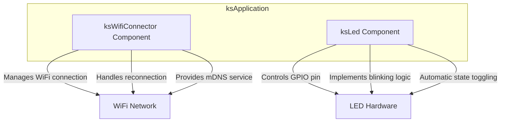
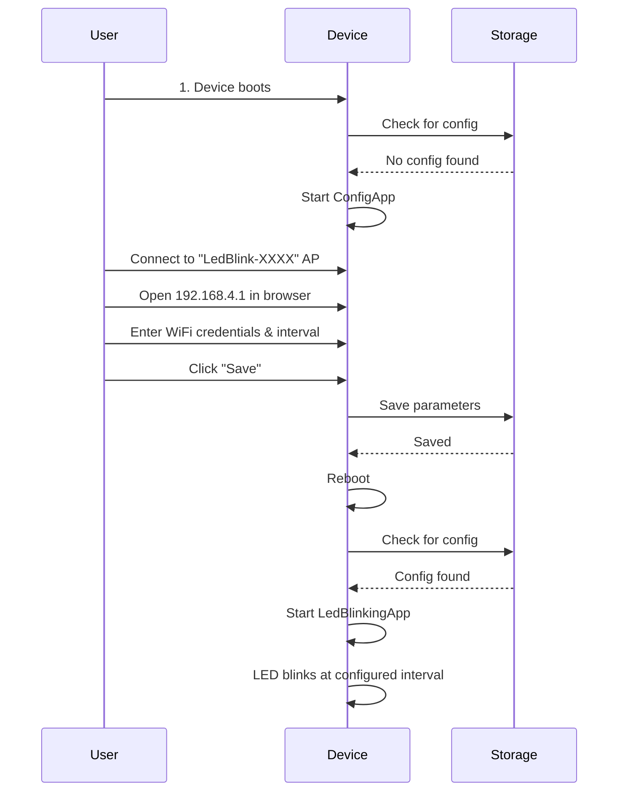

# LED Blink Example

A comprehensive tutorial demonstrating how to build a configurable LED blink application using the ksIotFrameworkLib. This example serves as an introduction to the framework's core concepts including applications, components, and configuration management.

## 📋 Table of Contents

- [🎯 Overview](#-overview)
- [📚 Learning Objectives](#-learning-objectives)
- [🔌 Hardware Requirements](#-hardware-requirements)
- [💻 Software Requirements](#-software-requirements)
- [⚙️ How It Works](#️-how-it-works)
- [📁 Code Structure](#-code-structure)
- [📖 Step-by-Step Guide](#-step-by-step-guide)
- [🔧 Configuration](#-configuration)
- [🐛 Troubleshooting](#-troubleshooting)
- [📚 Key Concepts Summary](#-key-concepts-summary)

## 🎯 Overview

This example creates a WiFi-enabled IoT device that blinks an LED at a user-configurable interval. The device features:

- **Configurable Blink Interval**: Set the LED blink speed through a web interface
- **WiFi Connectivity**: Automatic connection and reconnection to your WiFi network
- **Web Configuration**: Easy setup through a mobile-friendly configuration portal
- **Persistent Storage**: Configuration survives device reboots

## 📚 Learning Objectives

By studying this example, you will learn how to:

1. **Create Applications**: Structure your code using the ksApplication framework
2. **Use Components**: Leverage built-in components like ksLed and ksWifiConnector
3. **Manage Configuration**: Implement custom configuration parameters
4. **Handle Application Rotation**: Set up application rotation between different modes
5. **Work with Storage**: Read and write configuration to non-volatile memory
6. **Control Hardware**: Interact with GPIO pins to control an LED

## 🔌 Hardware Requirements

- **ESP8266** or **ESP32** development board
- **LED** (or use the built-in LED)
- **Resistor** (220-330Ω) if using an external LED
- **USB cable** for programming

### Wiring Diagram

For external LED:

```text
ESP GPIO Pin (default: 2) ---> [LED Anode (+)]
                               [LED Cathode (-)] ---> [Resistor] ---> GND
```

**Note**: Many ESP boards have a built-in LED on GPIO 2. If your board has one, no external wiring is needed!

## 💻 Software Requirements

- **PlatformIO IDE** (recommended) or Arduino IDE
- **Visual Studio Code** (for PlatformIO)
- This example project

For setup instructions, see the [main examples README](../readme.md).

## ⚙️ How It Works

### Application Architecture

The firmware uses an **application rotator** pattern with two applications:

#### 1. LedBlinkingApp (Primary Mode)

This is the main application that runs when WiFi credentials are configured:

- Reads the LED blink interval from configuration storage
- Connects to WiFi using saved credentials
- Creates and controls the LED component
- Blinks the LED at the configured interval
- If initialization fails (e.g., no WiFi credentials), the application rotator switches to ConfigApp

#### 2. ConfigApp (Configuration Mode)

- Creates a WiFi Access Point named "LedBlink-XXXX" (where XXXX is the device UUID)
- Hosts a web server at `192.168.4.1`
- Provides a configuration interface for:
  - WiFi SSID and password
  - LED blink interval (in milliseconds)
- Saves configuration to non-volatile storage
- Reboots device after saving

### Component Interaction



### Configuration Flow



## 📁 Code Structure

```text
led-blink/
├── platformio.ini              # PlatformIO configuration
├── README.md                   # This file
└── src/
    ├── board.h                 # Hardware pin definitions
    ├── main.cpp               # Entry point with app rotator
    └── apps/
        ├── LedBlinkingApp.h         # Main application header
        ├── LedBlinkingApp.cpp       # Main application implementation
        ├── ConfigApp.h         # Configuration app header
        ├── ConfigApp.cpp       # Configuration app implementation
        ├── BlinkConfigProvider.h   # Config provider header
        └── BlinkConfigProvider.cpp # Config provider implementation
```

### Key Files Explained

#### `board.h`

Defines hardware-specific constants. Change `LED_PIN` to match your hardware:

```cpp
#define LED_PIN 2  // GPIO pin number for LED
```

#### `main.cpp`

The application entry point. Uses `KSF_IMPLEMENT_APP_ROTATOR` macro to define the application rotation order:

```cpp
KSF_IMPLEMENT_APP_ROTATOR
(
    LedBlinkingApp,    // Try this first
    ConfigApp    // Fallback to this if LedBlinkingApp fails
)
```

#### `LedBlinkingApp` (Main Application)

The primary application that runs when WiFi is configured:

- Reads the blink interval from storage
- Creates WiFi and LED components
- Starts LED blinking
- Maintains WiFi connection

#### `ConfigApp` (Configuration Application)

The configuration interface:

- Creates an Access Point
- Provides web-based configuration
- Saves settings to storage

#### `BlinkConfigProvider`

Manages the custom "blink interval" configuration parameter:

- Defines the parameter structure
- Handles reading from storage
- Handles saving to storage

## 📖 Step-by-Step Guide

### Step 1: Open the Project

1. Open Visual Studio Code with PlatformIO installed
2. Select **File → Open Folder**
3. Navigate to and select the `examples/led-blink` folder
4. PlatformIO will automatically detect the project and install dependencies

### Step 2: Configure Hardware

1. Open `src/board.h`
2. Modify `LED_PIN` if needed to match your hardware:

   ```cpp
   #define LED_PIN 2  // Change this to your LED's GPIO pin
   ```

### Step 3: Select Your Board

1. Open `platformio.ini`
2. Find your target platform:
   - `[env:esp8266dev]` for ESP8266
   - `[env:esp32]` for ESP32
3. Click the platform name in the PlatformIO toolbar

### Step 4: Build and Upload

1. Click the **PlatformIO: Build** button (checkmark icon)
2. After successful build, connect your ESP device via USB
3. Click the **PlatformIO: Upload** button (arrow icon)
4. Wait for the upload to complete

### Step 5: Initial Configuration

1. After upload, the device will start in **ConfigApp** mode (no WiFi configured yet)
2. On your phone or computer, connect to the WiFi network named **"LedBlink-XXXX"** (where XXXX is your device's unique ID)
3. Open a web browser and navigate to `http://192.168.4.1`
4. You'll see the configuration interface with these fields:
   - **SSID**: Your WiFi network name
   - **Password**: Your WiFi password
   - **LED Blink Interval (ms)**: Time in milliseconds between LED state changes
5. Fill in your WiFi credentials
6. Set the blink interval (e.g., `1000` for 1-second interval, `500` for half-second)
7. Click **Save**
8. The device will save settings and reboot

### Step 6: Watch It Blink

1. After reboot, the device connects to your WiFi
2. The LED starts blinking at your configured interval
3. The device maintains WiFi connection automatically

## 🔧 Configuration

### Blink Interval Values

The blink interval is specified in **milliseconds**. Here are some example values:

| Interval (ms) | Description           | Blinks per Minute |
|---------------|----------------------|-------------------|
| 100           | Very fast blink      | 300               |
| 250           | Fast blink           | 120               |
| 500           | Medium blink         | 60                |
| 1000          | Slow blink (default) | 30                |
| 2000          | Very slow blink      | 15                |

**Note**: Setting the interval to `0` will turn off blinking and keep the LED in its current state.

### Changing Configuration Later

To modify the configuration after initial setup:

#### Method 1: Erase Configuration

- Use your development environment to erase the flash/filesystem
- On next boot, the device will start in ConfigApp mode (no credentials found)
- Reconfigure through the web interface

#### Method 2: Filesystem Access

- The configuration is stored in `/nvs/led_blink.cfg`
- Advanced users can access this file through the filesystem to modify or delete it

## 🐛 Troubleshooting

### LED Doesn't Blink

**Problem**: LED stays on or off continuously

**Solutions**:

- Verify `LED_PIN` matches your hardware in `board.h`
- Check that the blink interval is not set to `0`
- Ensure WiFi connection is successful
- Try a longer interval like `2000` to make blinking more visible

### Can't Connect to "LedBlink-XXXX"

**Problem**: WiFi network not visible

**Solutions**:

- Verify the device is powered and running
- Ensure device is in ConfigApp mode (first boot or WiFi failure)
- Try rebooting the device
- Check that your phone/computer supports 2.4GHz WiFi

### Configuration Doesn't Save

**Problem**: Settings revert after reboot

**Solutions**:

- Verify filesystem is properly initialized
- Ensure you clicked "Save" in the web interface
- Try erasing flash and reflashing firmware

### WiFi Connection Fails

**Problem**: Device doesn't connect to WiFi or LED doesn't blink

**Solutions**:

- Double-check WiFi SSID spelling (case-sensitive)
- Verify WiFi password is correct
- Ensure your WiFi is 2.4GHz (ESP8266/ESP32 don't support 5GHz)
- Check WiFi signal strength at device location
- Disable MAC address filtering on your router
- Check serial monitor for connection status messages

## 📚 Key Concepts Summary

This example demonstrates these framework concepts:

| Concept | Description | Used In |
|---------|-------------|---------|
| **ksApplication** | Base class for applications | LedBlinkingApp, ConfigApp |
| **ksComponent** | Reusable functional units | ksLed, ksWifiConnector |
| **Application Rotator** | Automatic app switching | main.cpp |
| **Config Storage** | Persistent configuration | BlinkConfigProvider |
| **Weak Pointers** | Safe component references | LedBlinkingApp::ledWp |
| **Component Lifecycle** | init() and loop() pattern | All components |

## 📝 Code Comments

All source files are heavily commented to explain:

- **What** the code does
- **Why** specific approaches are used
- **How** different parts interact
- **When** certain behaviors occur

Read through the source files to understand the implementation details!

## 💡 Tips

- **Start Simple**: Begin with the default configuration before customizing
- **Read Comments**: The code is extensively documented
- **Experiment**: Try different intervals and modifications

## 🤝 Contributing

Found an issue or have a suggestion? Please contribute to the [ksIotFrameworkLib repository](https://github.com/cziter15/ksIotFrameworkLib)!

## 📄 License

This example is part of ksIotFrameworkLib and follows the same license. See the main repository for details.

---

Happy Blinking 💡
